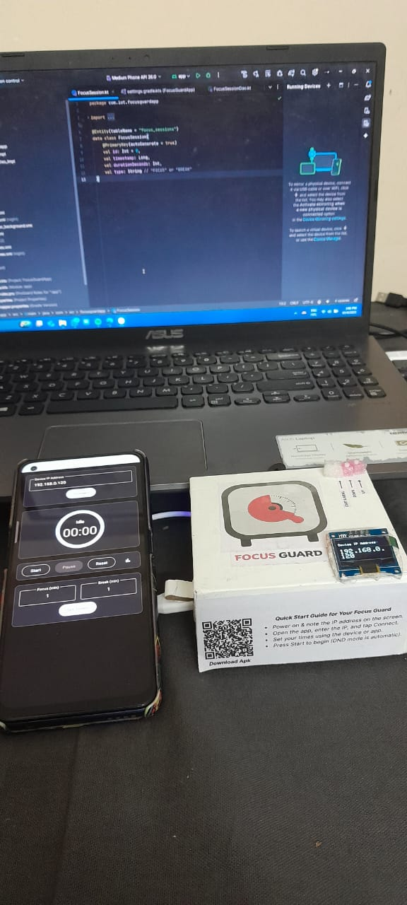
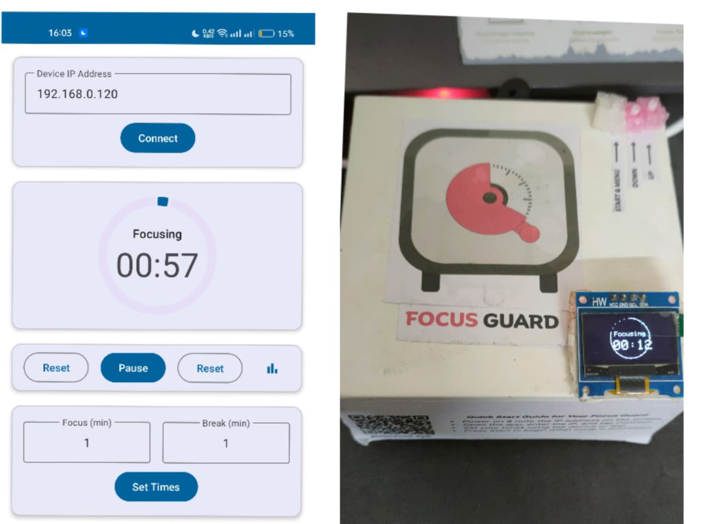
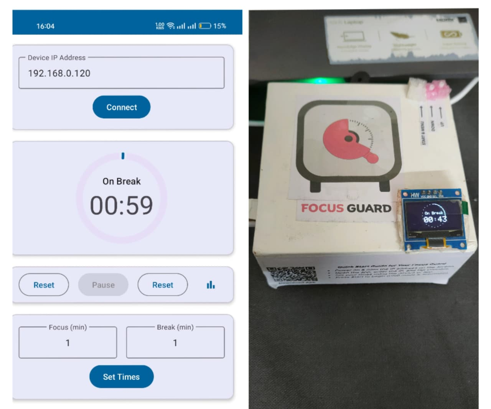
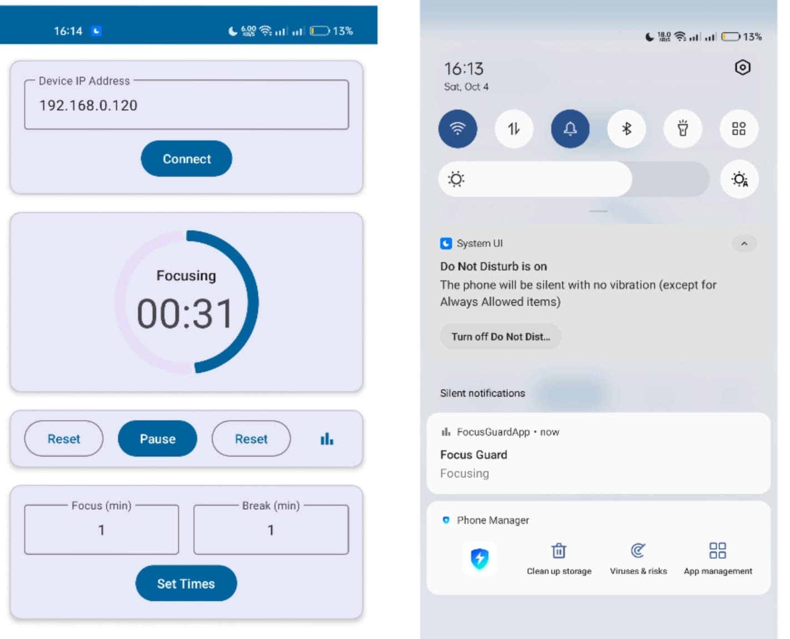
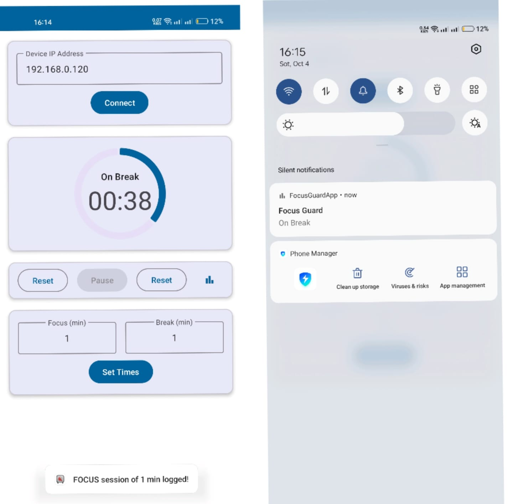
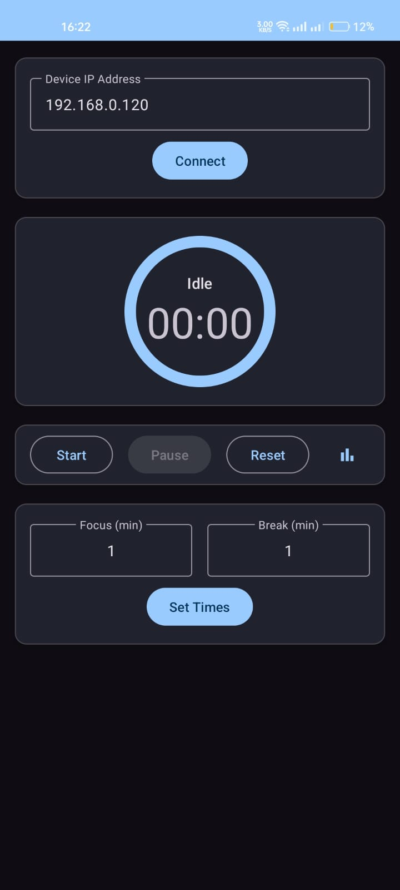
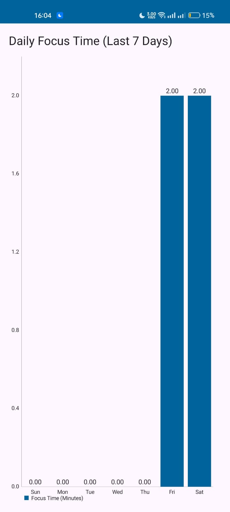
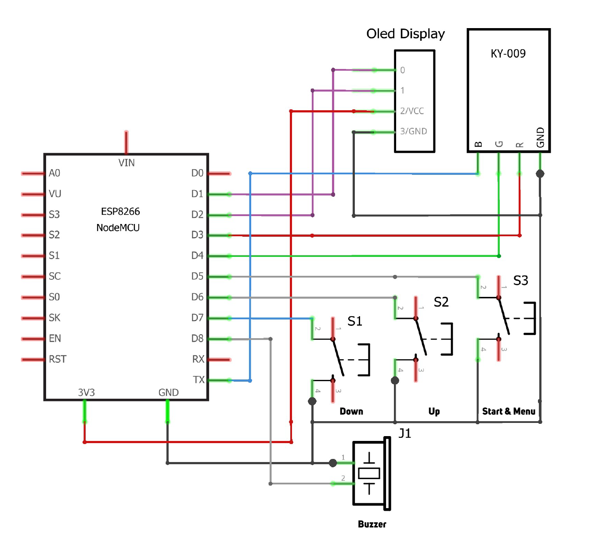

# 🧠 Focus Guard: A Full-Stack IoT Productivity System

Focus Guard is a complete hardware and software solution built from scratch to eliminate phone distractions and boost productivity. It combines a physical Pomodoro timer with a native Android application for seamless control and statistics tracking.

 

## ✨ Key Features

- **Automatic DND Control:** The app automatically activates/deactivates "Do Not Disturb" mode on your phone when a focus session starts or ends.
- **Real-Time Sync:** The physical device and Android app are synced over Wi-Fi for control from either interface.
- **Productivity Statistics:** The app saves a history of all completed sessions to a local database and visualizes daily usage in a bar chart.
- **Interactive Hardware:** The physical device features an interactive OLED menu, a visual circular progress timer, an RGB status light, and melodious buzzer alerts.
- **Professional App UI:** The Android app has a modern UI with automatic light/dark mode support and remembers the last used device IP address.

## 🛠️ Tech Stack

* **Hardware:** ESP8266, OLED Display, RGB LED, Buzzer
* **Device Software:** Arduino (C++), ESP8266 Web Server, ArduinoJson
* **App Software:** Android Studio (Kotlin), Room Database, MPAndroidChart, Volley

## 📂 Source Code

* **[Hardware (ESP8266)](FocusGuard/Hardware_ESP8266/Hardware_ESP8266.ino)**: Contains the complete Arduino sketch for the physical device.
* **[Android App Source Code](FocusGuard/Android_App)**: Contains the essential source files for the Android app.
    * **Note:** Due to the limitations of the GitHub web uploader, only the core `.kt` and `.xml` source files are included here. The full, buildable Android Studio project is too large to upload via this method.

## 🚀 Usage

1.  **Hardware:** Power on the Focus Guard device. It will connect to Wi-Fi and display its IP address.
2.  **App:** Open the Android app, enter the IP address, and tap "Connect".
3.  **Control:** Use either the physical buttons or the app to set times and start/pause sessions.
4.  **Statistics:** Completed sessions are logged automatically. Tap the stats icon to view your productivity history.

## 🖼️ Media

